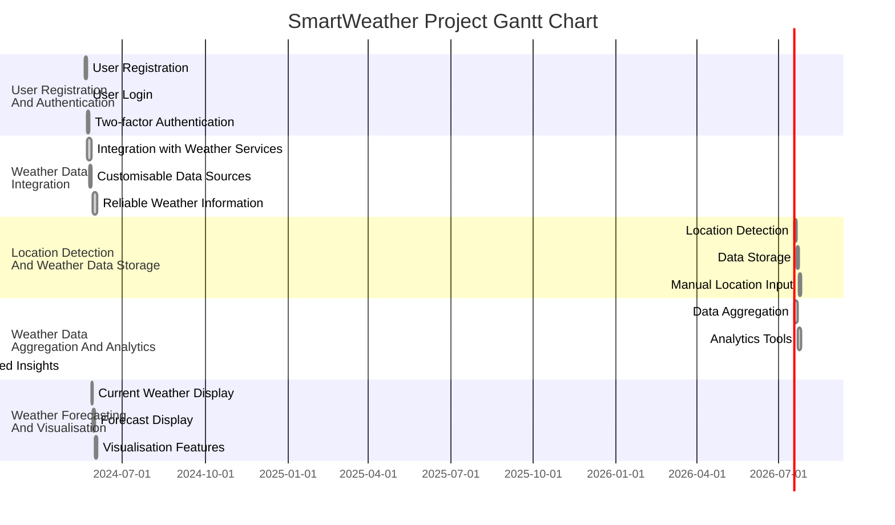
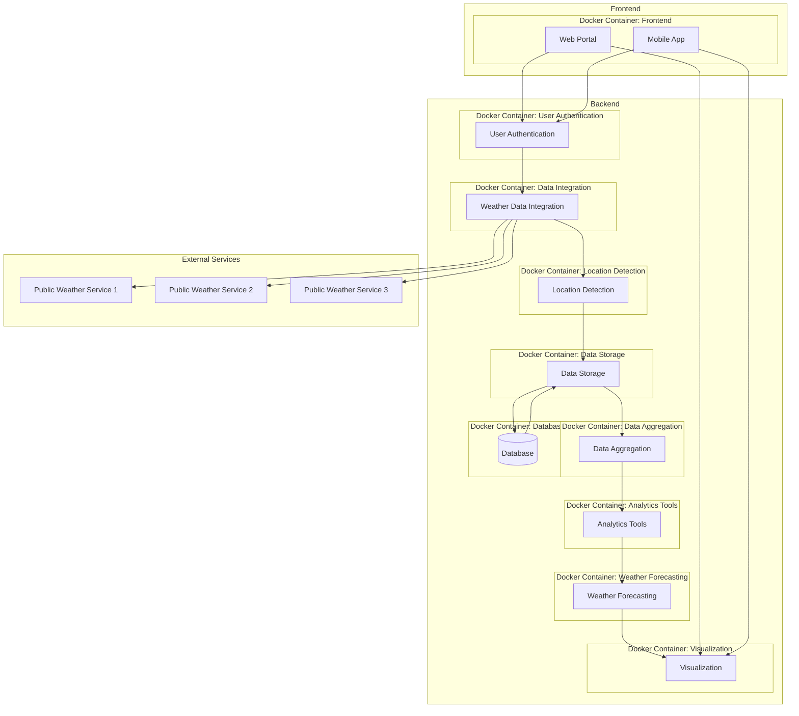

## Preface

Author: Simon Jackson (sjackson0109)

Date: 17/05/2024

The project applies Agile Scrum Master concepts to analyse a hypothetical organization. Participants are encouraged to apply techniques learned during the Agile Scrum Master course and explore creative applications of other methodologies. Project steps may not always follow a linear sequence, allowing for iteration and discovery of new ideas.

## Description:
The purpose of the project is to apply the concepts learned in the Agile `Scrum Master course by analysing a hypothetical organization.
Participants are encouraged to apply the techniques learned during the Agile Scrum Masters course, but also be creative with the application of other techniques from other sources.
The steps may not always be carried out in the same sequence in real life. Participants may iterate through steps, as they may uncover ideas as they proceed from one step to the next.

## Project Description
GTM systems is a large IT company with offices all around the world. The company delivers software products and services to corporate clients. One of the reasons for its enduring success and consistent performance over the years is the ability to leverage technology and find innovative applications for it.

## Company Background
GTM systems is a large IT company with offices all around the world. The company delivers software products and services to corporate clients. One of the reasons for its enduring success and consistent performance over the years is the ability to leverage technology and find innovative
applications for it.

## Problem Statement
While GTM has no expertise in meteorology, it proposes to aggregate weather data from multiple providers and uses analytics to correlate it with meaningful conclusions for businesses.
Example use cases could be generating forecasts based on local weather conditions around:
 - Consumption of hot versus cold beverages depending on cold, sunny, or rainy weather
 - Number of visitors to a tourist site or an open-air entertainment event
 - Likelihood of seasonal illnesses such as flu in particular locations. The main system will comprise a web portal and a set of `apps` available on the popular mobile operating systems. Apart from this, clients can ask for specific
services or apps based on the insights that the analytics can generate.

## Tasks
Tasks are as follows:
1. Write three personas for the users of the portal mentioned above. The personas should include Name, Role, Goals, Typical system usage, Preferences, and any other information relevant to the product.
2. Identify at least five epics and 15 user stories from the case above (use your interpretation and independent research). Link the stories to the epics.
3. Identify the minimally viable product considering the goal of the organization is to launch quickly and rapidly improve and expand the product footprint.
4. Propose a scaling model for this team given that different teams might be working on the development of the main system, interfaces, and integrations, custom-made apps, maintenance, and support.

## Smart Weather
With climate change increasing the unpredictability of local weather conditions, there has been great demand for technology that can provide reliable weather information. Weather conditions impact several organizations and businesses – ranging from agriculture, outdoor event management, hospitality, travel and tourism, and healthcare.

While GTM has no expertise in meteorology, it proposes to aggregate weather data from multiple providers and use analytics to correlate it with meaningful conclusions for businesses.

Example use cases could be generating forecasts based on local weather conditions around:

Consumption of hot versus cold beverages depending on cold, sunny or rainy weather
Number of visitors to a tourist site or an open-air entertainment event
Likelihood of seasonal illnesses such as flu in particular locations
The main system will comprise a web portal and a set of “apps” available on the popular mobile operating systems. Apart from this, clients can ask for specific services or apps based on the insights that the analytics can generate.

## Backlog for the main portal
| Index | Work Item                                                 |
|-------|-----------------------------------------------------------|
| 1     | Enable registration for free and paid users               |
| 2     | Build integrations with public weather services worldwide |
| 3     | Detect locations based on GPS or IP                       |
| 4     | Create a schema and a database for storing weather data based on location |
| 5     | Build logic to reconcile and aggregate data from multiple service providers |
| 6     | Access control for paid services                          |
| 7     | Provide severe weather advisory to registered users on the portal |
| 8     | Have provisions for advertisements on the portal and apps |
| 9     | Show current weather at a location                        |
| 10    | Show forecasts for five, ten, and fifteen days at a location |
| 11    | Provide seasonal forecasts like seasonal precipitation and temperatures |
| 12    | Show satellite images                                     |
| 13    | Show time-lapse videos of satellite forecasts             |
| 14    | Make a responsive design for the portal (usable for different devices and form factors) |
| 15    | Publish API or Services for client apps                   |
| 16    | Create apps for iOS and Android phones                    |

## Project Tasks
Based on the above scenario, you are expected to perform the following tasks.

Write three personas for the users of the portal mentioned above. The personas should include: Name, Role, Goals, Typical system usage, Preferences, and any other information relevant to the product.
Identify at least five epics and 15 user stories from the case above (use your interpretation and independent research). Link the stories to the epics.
Identify the minimally viable product considering the goal of the organization is to launch quickly and rapidly improve and expand the product footprint.
Propose a scaling model for this team given that different teams might be working on development of the main system, interfaces and integrations, bespoke apps, maintenance and support.

## Writeup

Submission of course work, requires a write-up, satisfying the requirements of the project tasks, and this must demonstrate agile practices.

Before presenting the personas, it's essential to understand the key user archetypes who will interact with the SmartWeather portal. These personas represent fictional but realistic users, each with distinct roles, goals, and preferences. By empathizing with these personas, we can better tailor the portal's features and functionalities to meet their diverse needs and expectations.

### Personas
There are just 3x personas to consider:

```mermaid
graph TD
    subgraph Z[" "]
        subgraph A[Sarah Weatherly]
        A_NOTES["Goals:<br>Attract more visitors by using accurate weather forecasts.<br>Usage: Checks portal for weather at tourist spots.<br>Preferences: Easy-to-understand weather info with pictures."]
        end 
        subgraph B[David Farmer]
        B_NOTES["Goals:<br>Advise farmers on planting and harvesting.<br>Usage: Checks portal for weather in farming areas.<br>Preferences: Clear and simple weather info."]
        end
        subgraph C[Emily Health]
        C_NOTES["Goals:<br>Prepare hospitals for weather-related health issues.<br>Usage: Checks portal for weather in healthcare regions.<br>Preferences: Detailed weather info affecting health."]
        end
    end
    style Z fill:#000,stroke:#333,stroke-width:4px;
    style A color:#000,fill:#4FD0A0,stroke:#333,stroke-width:4px;
    style B color:#000,fill:#87CEEB,stroke:#333,stroke-width:4px;
    style C color:#000,fill:#3A3DF1,stroke:#333,stroke-width:4px;
```

1. **Sarah Weatherly:**
   - **Name:** Sarah Weatherly
   - **Role:** Marketing Manager
   - **Goals:** Attract more visitors by utilizing accurate weather forecasts to plan effective marketing strategies.
   - **Typical System Usage:** Sarah frequently checks the SmartWeather portal to obtain weather forecasts for tourist spots and outdoor events. She relies on this information to plan targeted marketing campaigns and promotions.
   - **Preferences:** Sarah prefers weather information presented in an easy-to-understand format, preferably with visual aids such as charts or graphs. She values accuracy and timeliness in weather forecasts to make informed marketing decisions.

2. **David Farmer:**
   - **Name:** David Farmer
   - **Role:** Agricultural Consultant
   - **Goals:** Provide farmers with timely and accurate weather information to optimize planting and harvesting activities.
   - **Typical System Usage:** David utilizes the SmartWeather portal to access weather forecasts for different farming regions. He relies on this data to advise farmers on the best times for planting, irrigation, and harvesting.
   - **Preferences:** David prefers clear and concise weather information tailored to agricultural needs. He values detailed forecasts, including temperature, precipitation, and soil moisture content, to support informed decision-making in farming practices.

3. **Emily Health:**
   - **Name:** Emily Health
   - **Role:** Healthcare Administrator
   - **Goals:** Prepare healthcare facilities for weather-related health issues and emergencies.
   - **Typical System Usage:** Emily uses the SmartWeather portal to monitor weather conditions in healthcare regions, such as hospitals and medical facilities. She relies on this information to anticipate potential health risks associated with extreme weather events.
   - **Preferences:** Emily requires detailed weather forecasts that include information relevant to healthcare, such as temperature variations, humidity levels, and the likelihood of outbreaks. She values proactive alerts and notifications to ensure timely preparation for weather-related emergencies in healthcare settings.

### Epics

Epics are written with an objective, expressed with the end-users point-of-view, with just-enough technical description to steer the developer to find target the relevant code.  

1. **User Registration and Authentication:**
   - **User Story 1:** As a new user, I want to register for an account on the SmartWeather portal using my email address and password.
   - **User Story 2:** As a registered user, I want to log in securely to the SmartWeather portal to access personalized weather forecasts and features.
   - **User Story 3:** As a security-conscious user, I want the option for two-factor authentication to enhance the security of my account.

2. **Weather Data Integration:**
   - **User Story 4:** As a user, I want the SmartWeather portal to integrate with public weather services worldwide to provide comprehensive weather data.
   - **User Story 5:** As a user, I want access to reliable and up-to-date weather information sourced from reputable providers.
   - **User Story 6:** As a user, I want the ability to customize the data sources for weather information based on my preferences.

3. **Location Detection and Weather Data Storage:**
   - **User Story 7:** As a user, I want the SmartWeather portal to automatically detect my location using GPS or IP address.
   - **User Story 8:** As a user, I want weather data to be stored in a structured database based on location for easy retrieval.
   - **User Story 9:** As a user, I want the option to manually input or search for locations to access weather forecasts.

4. **Weather Data Aggregation and Analytics:**
   - **User Story 10:** As a user, I want the SmartWeather portal to aggregate data from multiple weather service providers to improve forecast accuracy.
   - **User Story 11:** As a user, I want access to analytics tools to interpret weather data and identify meaningful trends.
   - **User Story 12:** As a user, I want personalized insights and recommendations based on weather data analysis.

5. **Weather Forecasting and Visualization:**
   - **User Story 13:** As a user, I want to view current weather conditions at a specific location on the SmartWeather portal.
   - **User Story 14:** As a user, I want to see forecasts for the next five, ten, and fifteen days for a selected location.
   - **User Story 15:** As a user, I want interactive maps, charts, and visualizations to represent weather data effectively.

### Proposed Project Gantt Chart

## Minimally Viable Product (MVP):

For the SmartWeather project, the MVP should include:

1. **User Registration and Authentication:**
   - Enable users to register for an account on the SmartWeather portal using email and password.
   - Implement secure login functionality for authenticated users.

2. **Basic Weather Information:**
   - Provide users with access to current weather conditions at their location.
   - Offer five-day weather forecasts for selected locations.

3. **Location Detection:**
   - Automatically detect users' locations using GPS or IP address for personalized weather forecasts.
   - Allow users to manually input or search for locations to view weather information.

4. **Responsive Design:**
   - Ensure that the SmartWeather portal is responsive and accessible across different devices and screen sizes.

5. **API Provision:**
   - Publish APIs to enable integration with third-party applications or services.

By focusing on these core features, the SmartWeather MVP can provide users with valuable weather-related information while laying the foundation for future enhancements and expansions of the product.

## Business Minimal Product (BMP):

For the SmartWeather project, the BMP aims to provide essential features that can be marketed and sold to businesses, offering value and generating revenue. The BMP includes:

1. **Customizable Weather Data Integration:**
   - Offer businesses the ability to integrate SmartWeather data into their existing systems or applications.
   - Provide customizable data sources and APIs tailored to the specific needs of businesses.

2. **Advanced Weather Analytics:**
   - Implement advanced analytics tools to analyse weather data and derive actionable insights for businesses.
   - Offer predictive modeling capabilities to forecast weather trends and their potential impact on business operations.

3. **Sector-Specific Insights:**
   - Develop sector-specific weather insights tailored to industries such as agriculture, tourism, healthcare, and retail.
   - Provide detailed reports and forecasts that address the unique challenges and opportunities faced by each industry.

4. **API Monetization:**
   - Introduce monetization strategies for APIs, allowing businesses to access premium features and data through subscription models or pay-per-use plans.
   - Offer tiered pricing options based on usage levels and the level of access to advanced features.

5. **Integration Support and Training:**
   - Provide dedicated support and training services to help businesses integrate SmartWeather solutions into their operations seamlessly.
   - Offer comprehensive documentation, tutorials, and workshops to educate users on leveraging weather data effectively.

By focusing on these key features, the SmartWeather BMP targets businesses looking to leverage weather data to enhance decision-making, optimize operations, and gain a competitive edge in their respective industries.

## Scaling Model:

SmartWeather will be scaled horizontally by adding more servers to handle increased traffic and vertically by upgrading the hardware of existing servers. To effectively manage the diverse tasks involved in developing, maintaining, and expanding SmartWeather, the scaling model will involve the following:

1. **Team Structure:**
   - Dedicated Development Teams: Establish dedicated teams for various aspects of the project, including backend system development, frontend interface design, integrations and interfaces, app development, and maintenance/support.
   - Cross-Functional Teams: Form cross-functional teams comprising members with diverse expertise in meteorology, data analytics, software development, and user experience design to address the complex requirements of the project.
   - Agile Methodologies: Adopt Agile methodologies such as Scrum or Kanban to manage different teams and ensure efficient collaboration, iteration, and delivery of project milestones.

2. **Development Processes:**
   - Continuous Integration and Deployment: Implement continuous integration and deployment pipelines to streamline the development process, automate testing, and quickly deploy new features and updates.
   - Iterative Development: Embrace iterative development practices to allow for flexibility, adaptation to changing requirements, and incremental delivery of functionality.
   - Feedback Mechanisms: Establish feedback loops between teams and stakeholders to gather input, address concerns, and iterate on project deliverables continuously.

3. **Infrastructure Management:**
   - Scalable Computing Resources: Utilize scalable cloud computing resources to accommodate fluctuating workloads, ensure optimal performance, and support rapid scalability.
   - High-Availability Architecture: Design infrastructure with redundancy and failover mechanisms to ensure high availability, reliability, and minimal downtime.
   - Monitoring and Alerting: Implement robust monitoring and alerting systems to track system performance, detect anomalies, and facilitate proactive issue resolution.

4. **Collaboration and Communication:**
   - Regular Meetings and Stand-ups: Conduct regular meetings, stand-ups, and retrospectives to keep teams aligned, address challenges, and foster collaboration and communication.
   - Transparent Documentation: Maintain transparent documentation of project processes, decisions, and outcomes to facilitate knowledge sharing, onboarding of new team members, and continuity of operations.

5. **Continuous Improvement:**
   - Reviews and Reflections: Schedule regular reviews and reflections to evaluate project performance, identify lessons learned, and implement corrective actions for process improvement.
   - Training and Development: Invest in training and development opportunities for team members to enhance their skills, knowledge, and capabilities, ensuring readiness for future challenges and opportunities.

## Application Architecture (proposed)

---
### **SmartWeather - Project Planning Meeting**
|Data|Time|Location|
|---|---|---|
|Date: 2023-04-27|14:00|Remote|

### Agenda:

- Welcome and Introduction

- Brief introduction to the meeting purpose and agenda.
  - Review of Project Goals and Objectives
  - Discuss the overarching goals and objectives of the SmartWeather project.
  - Ensure alignment with stakeholders' expectations and project scope.

- Presentation of Project Timeline (we have 6x weeks for MVP/BVP stage)

- Review the proposed timeline for project execution, including key milestones and deliverables.

- Discuss any potential constraints or dependencies that may impact the timeline.

- Identification of Roles and Responsibilities.
  - Define roles and responsibilities for team members involved in the project.
  - Assign specific tasks and deliverables to each team member.
Discussion of Project Risks and Mitigation Strategies:

- Identify potential risks and challenges that may arise during project implementation.
  - Brainstorm mitigation strategies and contingency plans to address these risks effectively.

- Agreement on Communication and Reporting Protocols
  - Establish communication channels and frequency for project updates and progress reporting.
  - Explain how issues and concerns will be escalated and resolved within the project team.

- Confirmation of Next Steps and Action Items:
  - Summarise key decisions and action items from the meeting.
  - Confirm deadlines and responsibilities for completing action items.

- Closing Remarks:
  - Thank participants for their contributions and commitment to the project.
  - Set expectations for future meetings and ongoing project collaboration.

---
### **Project Charter - SmartWeather**

#### Overview:

- **Project Name:** SmartWeather
- **Project Manager:** Simon Jackson
- **Project Sponsor:** GTM Systems
- **Project Start Date:** 2024-05-02
- **Project End Date:** 2024-06-13
- **Project Objectives:** 
  - Develop a weather data aggregation and analytics platform.
  - Provide reliable weather information and forecasts for various industries.
  - Enable customization and integration with third-party applications.

#### Stakeholders:

- GTM Systems: Project Sponsor
- Development Team: Project Manager, Developers, Designers, Analysts
- End Users: Sarah Weatherly (Marketing Manager), David Farmer (Agricultural Consultant), Emily Health (Healthcare Administrator)
- Customers: Corporate clients using SmartWeather services

#### Scope:

- The project involves the development of the SmartWeather platform, including web portal and mobile apps.
- It encompasses integration with public weather services, location detection, weather data storage, aggregation, analytics, and visualization features.
- The scope also includes customization options, user authentication, and API provision for client apps.

#### Timeline:

- Project Start Date: [Insert Date]
- Project End Date: [Insert Date]
- Key Milestones:
  - Development Kickoff: [Insert Date]
  - Platform Integration: [Insert Date]
  - User Acceptance Testing: [Insert Date]
  - Deployment and Launch: [Insert Date]

#### Budget:

- Project Budget Allocation: [Insert Budget]
- Expenditure Tracking: [Insert Expense Categories and Budget Allocations]

#### Risks and Mitigation:

- Risks:
  - Dependency on third-party weather service providers
  - Technical challenges in data aggregation and analytics
  - User adoption and engagement issues
- Mitigation Strategies:
  - Establish agreements with multiple weather service providers to mitigate dependency risks.
  - Conduct thorough testing and validation of data integration and analytics algorithms.
  - Implement user feedback mechanisms and continuous improvement processes.

#### Communication Plan:

- Regular project status meetings with the development team and stakeholders.
- Weekly progress reports and updates via email.
- Monthly review meetings with project sponsor and key stakeholders.
- Ad-hoc communication channels for urgent issues and escalations.

#### Approval:

- Project Manager: Simon Jackson
- Project Sponsor (GTM Systems): John Smith

---

### **Project Plan - SmartWeather**

#### Project Overview:
The SmartWeather project aims to develop a weather forecasting and analytics platform that aggregates data from multiple sources and provides meaningful insights for businesses and end-users. The platform will include features such as user registration, weather data integration, location detection, data aggregation, forecasting, and visualization.

#### Project Objectives:
1. Develop a user-friendly web portal and mobile apps for accessing weather forecasts.
2. Integrate with public weather services worldwide to gather reliable weather data.
3. Implement location detection functionality using GPS or IP address.
4. Store weather data in a structured database based on location for easy retrieval.
5. Aggregate data from multiple sources and provide analytics tools for interpreting weather data.
6. Provide accurate weather forecasts and visualizations to users.
7. Ensure scalability and maintainability of the platform for future enhancements.

#### Key Deliverables:
1. User registration and authentication module.
2. Integration with public weather services.
3. Location detection and weather data storage functionality.
4. Data aggregation and analytics tools.
5. Weather forecasting and visualization features.
6. Deployable web portal and mobile apps.

#### Milestones:
1. **Milestone 1 (2024-07-01):** Completion of user registration and authentication module.
2. **Milestone 2 (2024-07-15):** Integration with public weather services and initial data gathering.
3. **Milestone 3 (2024-07-31):** Implementation of location detection and weather data storage.
4. **Milestone 4 (2024-08-15):** Development of data aggregation and analytics tools.
5. **Milestone 5 (2024-08-31):** Finalization of weather forecasting and visualization features.
6. **Milestone 6 (2024-09-15):** Deployment of the web portal and mobile apps.

#### Resources:
- Project Manager: [Name]
- Development Team: [List of team members]
- Weather Data Providers: [List of providers]
- Testing Team: [List of testers]
- Infrastructure: [Details of hosting environment]

#### Risks and Mitigation:
1. **Data Accuracy:** Ensure the accuracy and reliability of weather data by validating sources and implementing error handling mechanisms.
2. **Scalability:** Monitor system performance and scalability to handle increasing user loads and data volumes. Implement scaling strategies as needed.
3. **Security:** Implement robust security measures to protect user data and prevent unauthorized access. Regular security audits and updates are essential.
4. **User Experience:** Continuously gather user feedback and conduct usability testing to improve the user experience of the platform.
5. **Integration Challenges:** Anticipate integration challenges with third-party weather services and plan for contingencies to minimize disruptions.

#### Budget:
The project budget includes expenses for development resources, weather data subscriptions, infrastructure costs, and contingency funds. A detailed budget breakdown will be provided in the project financial plan.

#### Communication Plan:
Regular project status meetings will be conducted to review progress, address issues, and ensure alignment with project objectives. Communication channels include email updates, Slack channels, and weekly progress reports.

---

### Platform Design Questions and Answers (bonus credits)
To satisfy the SmartWeather app servicing customers, we need to design a platform to host the product on - without getting too technical, we need to answer the following minimum requirements:
1. **Compute Requirements:** Determine the computing power needed.   **Answer:** We'll need sufficient computing power to handle the expected workload and accommodate scalability requirements.

2. **Scalability:** Ensure the compute instance can scale as needed.   **Answer:** We'll choose a compute instance type with scalability options to adjust to workload fluctuations.

3. **Resource Allocation:** Allocate CPU, memory, and storage resources.   **Answer:** We'll allocate resources based on performance requirements, ensuring adequate CPU, memory, and storage capacity.

4. **Operating System:** Select an OS compatible with project requirements.   **Answer:** We'll choose an OS compatible with our software stack and any specific project needs.

5. **Networking:** Configure networking for connectivity.   **Answer:** Networking settings will be configured to ensure seamless connectivity with other project components.

6. **Monitoring and Management:** Implement monitoring tools.   **Answer:** We'll implement monitoring and management tools to track performance and identify issues.

7. **Security:** Implement security measures   **Answer:** Security measures will be implemented to protect the compute instance and data.

1. **Cost Optimization:** Optimize costs while maintaining performance.   **Answer:** We'll select a compute instance type that offers the right balance of performance and cost-efficiency.
