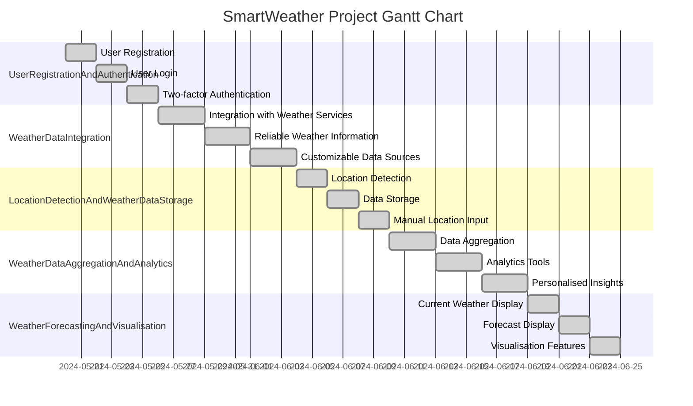

## Preface

Author: Simon Jackson (sjackson0109)

Date: 17/05/2024

## Description
The purpose of the project is to apply the concepts learned in the Agile Scrum Master course by analyzing a hypothetical organization.

Participants are encouraged to apply the techniques learned during the program but can also be creative in applying other techniques from other sources.

The steps may not always be carried out in the same sequence in real life. Participants may iterate through steps, as they may uncover ideas as they proceed from one step to the next.

## Project Description
GTM systems is a large IT company with offices all around the world. The company delivers software products and services to corporate clients. One of the reasons for its enduring success and consistent performance over the years is the ability to leverage technology and find innovative applications for it.

## Smart Weather
With climate change increasing the unpredictability of local weather conditions, there has been great demand for technology that can provide reliable weather information. Weather conditions impact several organizations and businesses – ranging from agriculture, outdoor event management, hospitality, travel and tourism, and healthcare.

While GTM has no expertise in meteorology, it proposes to aggregate weather data from multiple providers and use analytics to correlate it with meaningful conclusions for businesses.

Example use cases could be generating forecasts based on local weather conditions around:

Consumption of hot versus cold beverages depending on cold, sunny or rainy weather
Number of visitors to a tourist site or an open-air entertainment event
Likelihood of seasonal illnesses such as flu in particular locations
The main system will comprise a web portal and a set of “apps” available on the popular mobile operating systems. Apart from this, clients can ask for specific services or apps based on the insights that the analytics can generate.

## Backlog for the main portal
| Work Item                                                 |
|-----------------------------------------------------------|
| Enable registration for free and paid users               |
| Build integrations with public weather services worldwide |
| Detect locations based on GPS or IP                       |
| Create a schema and a database for storing weather data based on location |
| Build logic to reconcile and aggregate data from multiple service providers |
| Access control for paid services                          |
| Provide severe weather advisory to registered users on the portal |
| Have provisions for advertisements on the portal and apps |
| Show current weather at a location                        |
| Show forecasts for five, ten, and fifteen days at a location |
| Provide seasonal forecasts like seasonal precipitation and temperatures |
| Show satellite images                                     |
| Show time-lapse videos of satellite forecasts             |
| Make a responsive design for the portal (usable for different devices and form factors) |
| Publish API or Services for client apps                   |
| Create apps for iOS and Android phones                    |

## Project Tasks
Based on the above scenario, you are expected to perform the following tasks.

Write three personas for the users of the portal mentioned above. The personas should include: Name, Role, Goals, Typical system usage, Preferences, and any other information relevant to the product.
Identify at least five epics and 15 user stories from the case above (use your interpretation and independent research). Link the stories to the epics.
Identify the minimally viable product considering the goal of the organization is to launch quickly and rapidly improve and expand the product footprint.
Propose a scaling model for this team given that different teams might be working on development of the main system, interfaces and integrations, bespoke apps, maintenance and support.

## Writeup

### Personas ###

1. **Sarah Weatherly**
   - **Role:** Marketing Manager
   - **Goals:** Sarah is responsible for promoting outdoor events and attractions for a travel and tourism company. Her main goal is to attract more visitors to these locations by providing accurate weather forecasts.
   - **Typical System Usage:** Sarah often checks the portal to see what the weather will be like for different tourist spots and outdoor events. She needs to know if it's going to be sunny or rainy so she can plan the best way to advertise and get people interested.
   - **Preferences:** Sarah likes it when the weather information is easy to understand, with nice pictures or charts. She wants to know if it's going to be warm or cold and if there might be rain, so she can decide how to promote events effectively.

2. **David Farmer**
   - **Role:** Agricultural Consultant
   - **Goals:** David helps farmers figure out how to grow their crops better. He needs to know about the weather so he can tell them when to plant and when to harvest.
   - **Typical System Usage:** David uses the portal to check the weather for different areas where farmers work. He wants to see if it's going to be hot or cold and if there might be rain, so he can give the best advice to farmers.
   - **Preferences:** David likes it when the weather information is clear and simple. He wants to know if it's going to be a good day for farming or if there might be bad weather that could ruin crops.

3. **Emily Health**
   - **Role:** Healthcare Administrator
   - **Goals:** Emily looks after hospitals and health programs in different places. She needs to know about the weather so she can prepare for things like flu season.
   - **Typical System Usage:** Emily uses the portal to see what the weather will be like in different areas where there are hospitals. She wants to know if it's going to be hot or cold and if there might be storms, so she can make sure hospitals are ready.
   - **Preferences:** Emily likes it when the weather information is easy to understand, with clear details about things like temperature and rain. She wants to know if there might be bad weather that could affect people's health.

### Epics ###

A. User Registration and Authentication
   - A1: As a user, I want to register for an account on the portal using my email address and password.
   - A2: As a user, I want to log in to the portal securely to access personalised weather forecasts and features.
   - A3: As a user, I want the option for two-factor authentication to enhance account security.

B. Weather Data Integration
   - B1: As a user, I want the portal to integrate with public weather services worldwide to provide comprehensive weather data.
   - B2: As a user, I want accurate and up-to-date weather information sourced from reliable providers.
   - B3: As a user, I want the ability to select preferred weather data sources for my region.

C. Location Detection and Weather Data Storage
   - C1: As a user, I want the portal to detect my location automatically using GPS or IP address.
   - C2: As a user, I want weather data to be stored in a structured database based on location for easy retrieval.
   - C3: As a user, I want the option to manually input or search for locations to access weather forecasts.

D. Weather Data Aggregation and Analytics
   - D1: As a user, I want the portal to aggregate data from multiple weather service providers to improve forecast accuracy.
   - D2: As a user, I want access to analytics tools to interpret weather data and identify meaningful trends.
   - D3: As a user, I want personalised insights and recommendations based on weather data analysis.

E. Weather Forecasting and Visualisation
   - E1: As a user, I want to view current weather conditions at a specific location on the portal.
   - E2: As a user, I want to see forecasts for the next five, ten, and fifteen days for a selected location.
   - E3: As a user, I want interactive maps, charts, and visualisations to represent weather data effectively.

**Minimally Viable Product (MVP):**
The MVP for SmartWeather should include:
- User registration and authentication
- Integration with at least one reliable weather service provider
- Basic location detection and weather data storage functionality
- Current weather display for user's location
- Five-day weather forecast
- Responsive design for the portal
- API provision for client apps

**Scaling Model:**
Considering the diverse tasks involved in developing, maintaining, and expanding SmartWeather, a scaling model could involve:
- Dedicated development teams for backend system development, frontend interface design, integrations and interfaces, app development, and maintenance/support.
- Agile methodologies like Scrum or Kanban to manage different teams and ensure efficient collaboration.
- Continuous integration and deployment pipelines to streamline the development process and quickly deploy new features and updates.
- Cross-functional teams with expertise in meteorology, data analytics, software development, and user experience design to address the complex requirements of the project.
